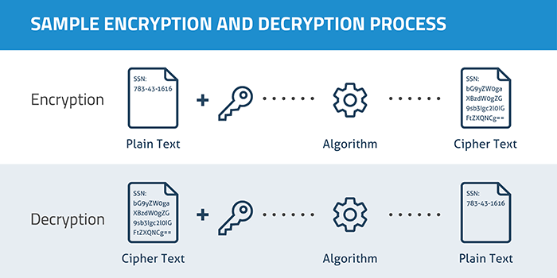
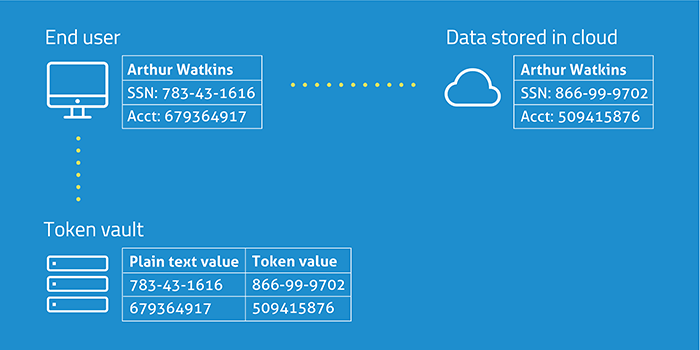

####术语解释
######token:
 是一个随机字符串，用来代替原始数据。    
#####Tokenization
Tokenization是将数据标记成随机字符串token。和加密不同，标记化不使用数学过程对敏感信息转换成，也就是说生成的token是不可逆的。
Tokenization通常使用数据库（或者其他方式）存储敏感值与token之间的关系。

####Encrypt


####Tokenization


####MD5功能：
    输入任意长度的信息，经过处理，输出为128位的信息（数字指纹)。
    不同的输入得到的不同的结果（唯一性）。
    MD5不属于加密算法,一般用来做数字签名和数据校验，防止数据被篡改。

####Encrypt和Tokenization对比
Encrtpy |  Tokenization | 
:----------- | :-----------  | 
使用加密算法和密钥，通过数学公式转换将原始数据生成密文         		| 随机生成的token值，原始数据和token值在数据库中存储的映射关系        | 
加解密过程可逆，跟数据大小无关，根据密钥加密解密数据         | 加解密过程不可逆，只能根据数据库原始数据和token值的映射关系解密数据        | 
用于结构化的领域，以及非结构化数据，例如整个文件|用于结构化数据领域，如电话号码，信用卡号码等|
与第三方交互只需要密钥就可以获取原始数据|第三方很难获取原始数据，因为必须得到数据库映射token值才能直接获取原始数据|
原始数据以加密的方式离开企业|原始数据永远不会离开企业，满足一定的合规要求|

####Tokenization优点

```
1.减少数据泄露:tokenization的一个关键优势是原始数据只值存储在企业服务器内部,这样可以减少原始数据泄露。由于token值和原始数据没有数学关系，其过程不可逆，即使获取到token值也没什么意义。

2.减少对业务的影响:toeknization可以通过使用相同的格式来保护敏感数据，相对加密来说，对业务影响小，例如,加密不仅涉及密钥管理,而且会破坏原始数据格式，提交的密文可能不符合特定格式要求。

3.减少合规范围和成本:对于敏感数据，企业必须有技术基础设施来确保存储和传输敏感数据的安全，使用token交互可以减少用户访问敏感信息的数量,减少合规审计的成本和时间。

4.某些应用功能场景:例如排序和搜索.加密有可能会破坏原始数据格式，如果某些场景需要特定格式，例如信用卡号码或电子邮件地址等。
```
